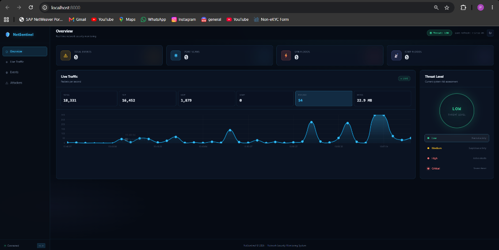

<div align="center">


# 🛡️ NetSentinel

### Network Security Monitoring System

**Real-time detection of port scans, SYN floods & ICMP floods with a professional SOC dashboard**

---

[](https://python.org)
[](https://fastapi.tiangolo.com)
[](https://scapy.net)
[](LICENSE)
[](https://github.com/prajit003/-NetSentinel/stargazers)

<br/>



> **Overview page** — Live traffic chart (18,331 packets), Threat Level ring (LOW), stat cards, and sidebar navigation running on localhost:8000

</div>

---

## 📋 Table of Contents

- [Overview](#-overview)
- [Features](#-features)
- [Architecture](#-architecture)
- [Dashboard Preview](#-dashboard-preview)
- [Quick Start](#-quick-start)
- [Project Structure](#-project-structure)
- [How Detection Works](#-how-detection-works)
- [Risk Scoring](#-risk-scoring)
- [API Reference](#-api-reference)
- [Technology Stack](#-technology-stack)
- [Running Tests](#-running-tests)
- [Configuration](#-configuration)
- [Troubleshooting](#-troubleshooting)

---

## 🔍 Overview

**NetSentinel** is a lightweight, self-hosted **Network Security Monitoring System** built entirely in Python. It captures live network packets using [Scapy](https://scapy.net), runs real-time threat detection algorithms, stores security events in a local SQLite database, and presents everything through a modern **Security Operations Center (SOC)** style web dashboard.

It is designed to run on your local machine or a dedicated server, giving you full visibility into what's happening on your network — without sending your data anywhere.

```
Your Network Traffic
        │
        ▼
   [Scapy Sniffer]        ← captures raw IP packets
        │
        ├──► [Port Scan Detector]   ─► alert if 10+ ports/10s
        ├──► [SYN Flood Detector]   ─► alert if 20+ SYN/5s
        └──► [ICMP Flood Detector]  ─► alert if 30+ ICMP/5s
                    │
                    ▼
             [SQLite Database]      ← stores security_events
                    │
                    ▼
             [FastAPI REST API]     ← serves dashboard + data
                    │
                    ▼
          [SOC Web Dashboard]       ← live charts, alerts, toasts
```

---

## ✨ Features

### 🚨 Detection Engine
| Attack Type | Threshold | Time Window | Severity |
|------------|-----------|-------------|----------|
| **Port Scan** | 10+ distinct ports | 10 seconds | MEDIUM → CRITICAL |
| **SYN Flood** | 20+ SYN packets | 5 seconds | HIGH → CRITICAL |
| **ICMP Flood** | 30+ ICMP packets | 5 seconds | MEDIUM → CRITICAL |

### 📊 Dashboard
- **Threat Level Ring** — animated LOW / MEDIUM / HIGH / CRITICAL indicator calculated dynamically from recent events
- **Live Traffic Chart** — real-time packets-per-second chart with gradient fill and tooltips
- **Top Attackers Table** — ranked list of source IPs by total event count with per-type breakdown
- **Security Events Table** — full paginated table (25/page) with severity row highlighting
- **Stat Cards** — animated counters for Total Events, Port Scans, SYN Floods, ICMP Floods
- **Toast Notifications** — pop-up alerts that appear automatically when new attacks are detected
- **Live Connection Dot** — pulsing green/red indicator showing server connectivity

### 🔧 Functionality
- **Filter events** by alert type and severity
- **Export CSV** — download all events as a spreadsheet
- **Clear All Events** — reset the database with one click
- **Pagination** — 25 events per page for performance
- **Multi-page sidebar** — Overview, Live Traffic, Events, Attackers
- **Auto-refresh** — dashboard updates every 5 seconds

### 🏗️ Backend
- Thread-safe detection with `threading.Lock` on all shared state
- Configurable thresholds via module-level constants
- Auto-creates `logs/` directory and SQLite database on first run
- Modern FastAPI `lifespan` context manager (not deprecated `on_event`)
- DB index on `alert_type` for fast stats queries
- REST API with pagination, filtering, CSV export, and clear endpoint

---

## 🏛️ Architecture

```
NetSentinel/
│
├── backend/
│   ├── __init__.py
│   ├── main.py              ← FastAPI app, all REST routes, lifespan startup
│   ├── packet_capture.py    ← Scapy sniff loop + detector dispatch per packet
│   ├── detector.py          ← Port scan / SYN flood / ICMP flood detection logic
│   ├── traffic.py           ← Packet counters, history ring buffer, record_packet()
│   ├── database.py          ← SQLite helpers: create, save, clear, get events
│   └── risk.py              ← Risk score (0–100) + severity (LOW/MEDIUM/HIGH/CRITICAL)
│
├── frontend/
│   ├── index.html           ← SOC dashboard HTML with sidebar + multi-page layout
│   ├── script.js            ← API polling, chart, toasts, filters, pagination, counters
│   └── style.css            ← Dark cyberpunk glassmorphism theme with CSS variables
│
├── tests/
│   ├── __init__.py
│   └── test_detector.py     ← pytest suite: 20+ tests for detection + risk engine
│
├── logs/
│   └── netsentinel.db       ← Auto-created SQLite database (gitignored)
│
├── requirements.txt
└── README.md
```

### Data Flow

```
                    ┌─────────────────────────────────────────┐
                    │              packet_capture.py           │
                    │                                         │
  Network ─────────►│  sniff(filter="ip", prn=process_packet) │
  Traffic           │                                         │
                    │   For each IP packet:                   │
                    │   ├─ record_packet()  → traffic.py      │
                    │   ├─ detect_port_scan()  → detector.py  │
                    │   ├─ detect_syn_flood()  → detector.py  │
                    │   └─ detect_icmp_flood() → detector.py  │
                    └─────────────────┬───────────────────────┘
                                      │ alert fired
                                      ▼
                    ┌─────────────────────────────────────────┐
                    │              database.py                 │
                    │                                         │
                    │  save_security_event(type, ip, details) │
                    │  → INSERT INTO security_events          │
                    └─────────────────┬───────────────────────┘
                                      │
                                      ▼
                    ┌─────────────────────────────────────────┐
                    │               main.py (FastAPI)          │
                    │                                         │
                    │  GET /api/events   → events + risk score│
                    │  GET /api/stats    → counts + threat lvl│
                    │  GET /api/traffic  → live pkt stats     │
                    │  GET /api/top-ips  → ranked attackers   │
                    └─────────────────┬───────────────────────┘
                                      │ JSON
                                      ▼
                    ┌─────────────────────────────────────────┐
                    │            Dashboard (Browser)           │
                    │                                         │
                    │  Polls every 5 seconds                  │
                    │  Renders chart, table, threat ring      │
                    │  Shows toast for new events             │
                    └─────────────────────────────────────────┘
```

---

## 🖥️ Dashboard Preview

### Overview Page
The main dashboard shows four stat cards (Total Events, Port Scans, SYN Floods, ICMP Floods), a real-time packets-per-second chart, and a glowing **Threat Level Ring** that dynamically reflects the current risk level.


### Events Page
Full paginated table of security events with:
- Color-coded severity badges (green / amber / red / pulsing critical)
- Per-row background highlighting for HIGH and CRITICAL events
- Filter dropdowns for Alert Type and Severity
- Export to CSV and Clear All buttons

### Attackers Page
Ranked table of source IPs sorted by total events, with per-type breakdown (port scans, SYN floods, ICMP floods) and last-seen timestamp.

### Toast Notifications
When a new attack is detected while the dashboard is open, a pop-up notification slides in from the bottom-right corner with the attack type, source IP, and severity — automatically dismisses after 6 seconds.

---

## 🚀 Quick Start

### Prerequisites

| Requirement | Notes |
|-------------|-------|
| Python 3.10+ | [Download](https://python.org/downloads) |
| Administrator / root | Required for Scapy raw socket capture |
| Modern browser | Chrome, Firefox, Edge |

### 1. Clone the Repository

```bash
git clone https://github.com/prajit003/-NetSentinel.git
cd -NetSentinel
```

### 2. Install Dependencies

```bash
pip install -r requirements.txt
```

This installs:
- `fastapi` — web framework
- `uvicorn` — ASGI server
- `scapy` — packet capture library
- `pytest` — test runner
- `httpx` — async HTTP client (for tests)

### 3. Run the Server

> ⚠️ **Must run as Administrator on Windows / root on Linux** for Scapy to access raw sockets.

**Windows (PowerShell as Administrator):**
```powershell
uvicorn backend.main:app --host 0.0.0.0 --port 8000 --reload
```

**Linux / macOS:**
```bash
sudo uvicorn backend.main:app --host 0.0.0.0 --port 8000 --reload
```

### 4. Open the Dashboard

Navigate to **http://localhost:8000** in your browser.

The `logs/` directory and SQLite database are created automatically on first run.

---

## 🔬 How Detection Works

### Port Scan Detection

NetSentinel tracks the number of **distinct destination ports** contacted by each source IP within a 10-second sliding window.

```
For each TCP packet from IP X to port P:
  1. Add port P to connections[X]  (a set — duplicates ignored)
  2. If time_elapsed ≤ 10s AND len(connections[X]) ≥ 10:
       → Fire PORT_SCAN alert
       → Save to database
       → Reset window
  3. Else if time_elapsed > 10s:
       → Reset window, start fresh
```

This catches tools like `nmap` performing a rapid sweep across many ports.

### SYN Flood Detection

A SYN flood sends a high volume of TCP SYN packets to exhaust the target's connection table. NetSentinel tracks SYN packet counts per source IP in a 5-second window.

```
For each TCP SYN packet (flags == "S") from IP X:
  1. syn_count[X] += 1
  2. If time_elapsed ≤ 5s AND syn_count[X] ≥ 20:
       → Fire SYN_FLOOD alert
       → Save to database
       → Reset counter
  3. Else if time_elapsed > 5s:
       → Reset counter to 1, start fresh
```

### ICMP Flood Detection

An ICMP flood (ping flood) overwhelms the target with ICMP Echo Requests. Tracked per source IP in a 5-second window.

```
For each ICMP packet from IP X:
  1. icmp_count[X] += 1
  2. If time_elapsed ≤ 5s AND icmp_count[X] ≥ 30:
       → Fire ICMP_FLOOD alert
       → Save to database
       → Reset counter
  3. Else if time_elapsed > 5s:
       → Reset counter to 1, start fresh
```

All detectors use a `threading.Lock` to ensure thread-safe access to shared state since packet processing runs in a background daemon thread.

---

## 📈 Risk Scoring

Each security event is assigned a **risk score** (0–100) and a **severity** label based on the attack type and the raw count embedded in the event details.

### Severity Levels

| Score | Severity | Color | Meaning |
|-------|----------|-------|---------|
| ≥ 95 | 🔴 **CRITICAL** | Red (pulsing) | Extreme threat, immediate action required |
| ≥ 80 | 🟠 **HIGH** | Red | Active attack underway |
| ≥ 50 | 🟡 **MEDIUM** | Amber | Suspicious activity |
| < 50 | 🟢 **LOW** | Green | Minimal risk |

### Port Scan Risk Table

| Distinct Ports | Risk Score |
|---------------|-----------|
| ≥ 50 | 98 |
| ≥ 30 | 95 |
| ≥ 20 | 90 |
| ≥ 15 | 85 |
| ≥ 10 | 70 |
| ≥ 5  | 50 |
| < 5  | 30 |

### SYN Flood Risk Table

| SYN Packets | Risk Score |
|------------|-----------|
| ≥ 200 | 100 |
| ≥ 100 | 97 |
| ≥ 50  | 90 |
| ≥ 20  | 80 |
| ≥ 10  | 65 |
| < 10  | 40 |

### ICMP Flood Risk Table

| ICMP Packets | Risk Score |
|-------------|-----------|
| ≥ 200 | 98 |
| ≥ 100 | 90 |
| ≥ 50  | 80 |
| ≥ 30  | 65 |
| < 30  | 40 |

### Threat Level Algorithm

The overall **Threat Level** shown on the dashboard is computed from the last 50 events:

```
CRITICAL events ≥ 3           → System Threat Level: CRITICAL
CRITICAL events ≥ 1 OR
HIGH events ≥ 5               → System Threat Level: HIGH
HIGH events ≥ 1 OR
total attacks > 5             → System Threat Level: MEDIUM
Otherwise                     → System Threat Level: LOW
```

---

## 🌐 API Reference

Base URL: `http://localhost:8000`

### `GET /`
Serves the web dashboard HTML.

---

### `GET /api/health`
Returns server health status.

**Response:**
```json
{
  "status": "online",
  "service": "NetSentinel",
  "version": "2.0",
  "database": true,
  "frontend": true
}
```

---

### `GET /api/stats`
Returns event counts and the current threat level.

**Response:**
```json
{
  "total_events": 42,
  "port_scans":   18,
  "syn_floods":   20,
  "icmp_floods":   4,
  "threat_level": "HIGH"
}
```

---

### `GET /api/events`
Returns paginated and filtered security events.

**Query Parameters:**

| Parameter | Type | Default | Description |
|-----------|------|---------|-------------|
| `limit` | int | 50 | Max events returned (1–500) |
| `offset` | int | 0 | Pagination offset |
| `alert_type` | string | _(all)_ | `PORT_SCAN` \| `SYN_FLOOD` \| `ICMP_FLOOD` |
| `severity` | string | _(all)_ | `LOW` \| `MEDIUM` \| `HIGH` \| `CRITICAL` |

**Response:**
```json
{
  "total": 42,
  "limit": 50,
  "offset": 0,
  "events": [
    {
      "id": 42,
      "timestamp": "2026-09-19 14:30:00",
      "alert_type": "PORT_SCAN",
      "source_ip": "192.168.1.100",
      "details": "PORT_COUNT=15 PORTS=[21, 22, 80, 443, ...]",
      "risk_score": 85,
      "severity": "HIGH"
    }
  ]
}
```

---

### `GET /api/events/export`
Downloads all security events as a **CSV file**.

**Headers returned:**
```
Content-Disposition: attachment; filename=netsentinel_events.csv
Content-Type: text/csv
```

---

### `DELETE /api/events`
Deletes all security events from the database.

**Response:**
```json
{ "message": "All security events cleared." }
```

---

### `GET /api/traffic`
Returns live network traffic statistics.

**Response:**
```json
{
  "total_packets": 15000,
  "tcp_packets":   10000,
  "udp_packets":    4000,
  "icmp_packets":   1000,
  "total_bytes":  9437184,
  "packets_per_second": 47,
  "history": [
    { "time": "14:30:01", "packets_per_second": 45 },
    { "time": "14:30:02", "packets_per_second": 51 }
  ]
}
```

---

### `GET /api/top-ips`
Returns the top attacking source IPs ranked by total event count.

**Query Parameters:**

| Parameter | Type | Default | Description |
|-----------|------|---------|-------------|
| `limit` | int | 10 | Max IPs to return (1–50) |

**Response:**
```json
[
  {
    "source_ip":   "192.168.1.100",
    "total":       18,
    "port_scans":  10,
    "syn_floods":   6,
    "icmp_floods":  2,
    "last_seen":   "2026-09-19 14:35:22"
  }
]
```

---

## 🧰 Technology Stack

| Layer | Technology | Purpose |
|-------|-----------|---------|
| **Packet Capture** | [Scapy 2.5+](https://scapy.net) | Raw socket packet sniffing |
| **Web Framework** | [FastAPI 0.111+](https://fastapi.tiangolo.com) | REST API + static file serving |
| **ASGI Server** | [Uvicorn](https://uvicorn.org) | High-performance async server |
| **Database** | SQLite (built-in) | Persistent event storage |
| **Frontend** | Vanilla JS + HTML + CSS | Zero-dependency dashboard |
| **Charts** | [Chart.js](https://chartjs.org) | Real-time line chart |
| **Testing** | [pytest](https://pytest.org) | Unit and integration tests |

---

## 🧪 Running Tests

```bash
# Run all tests with verbose output
pytest tests/ -v

# Run a specific test class
pytest tests/test_detector.py::TestPortScanDetection -v

# Run with coverage (if pytest-cov is installed)
pytest tests/ -v --cov=backend
```

**Test coverage includes:**

| Test Class | What It Tests |
|-----------|---------------|
| `TestPortScanDetection` | Below threshold, at threshold, duplicate ports, window expiry |
| `TestSynFloodDetection` | Below threshold, at threshold, counter reset, window expiry |
| `TestIcmpFloodDetection` | Below threshold, at threshold, counter reset |
| `TestRiskEngine` | Severity mapping, port scan risk, SYN risk, ICMP risk, `calculate_risk()` integration |

---

## ⚙️ Configuration

Detection thresholds can be changed in [`backend/detector.py`](backend/detector.py):

```python
# Port Scan
PORT_SCAN_PORT_THRESHOLD  = 10   # distinct ports before alert
PORT_SCAN_TIME_WINDOW     = 10   # detection window in seconds

# SYN Flood
SYN_FLOOD_COUNT_THRESHOLD = 20   # SYN packets before alert
SYN_FLOOD_TIME_WINDOW     = 5    # detection window in seconds

# ICMP Flood
ICMP_FLOOD_COUNT_THRESHOLD = 30  # ICMP packets before alert
ICMP_FLOOD_TIME_WINDOW     = 5   # detection window in seconds
```

The dashboard auto-refreshes every 5 seconds. To change this, edit `script.js`:

```javascript
// Line in script.js
setInterval(loadDashboard, 5000);   // change 5000 to desired ms
```

---

## 🔧 Troubleshooting

### "Permission denied" / no packets captured

Scapy requires **raw socket access**. Run as Administrator on Windows:

```powershell
# Open PowerShell as Administrator
uvicorn backend.main:app --reload
```

Or root on Linux/macOS:

```bash
sudo uvicorn backend.main:app --reload
```

---

### `ModuleNotFoundError: No module named 'backend'`

Run uvicorn from the **project root directory** (where `backend/` folder is), not from inside `backend/`:

```bash
# ✅ Correct — from project root
cd -NetSentinel
uvicorn backend.main:app --reload

# ❌ Wrong
cd -NetSentinel/backend
uvicorn main:app --reload
```

---

### Dashboard shows all zeros / no events

This is expected if Scapy can't capture packets (no admin rights). The dashboard UI still works — events, filters, and CSV export all function normally.

To generate test events without a real attack, run the test file:

```bash
# This will simulate port scan + SYN flood and save events to the DB
python tests/test_detector.py
```

---

### Port 8000 already in use

```bash
# Find what's using port 8000
netstat -ano | findstr :8000

# Use a different port
uvicorn backend.main:app --port 8080
```

---

## 📄 License

This project is open source and available under the [MIT License](LICENSE).

---

<div align="center">

Built with ❤️ using Python, FastAPI & Scapy

**[⭐ Star this repo](https://github.com/prajit003/-NetSentinel)** if you found it useful!

</div>
